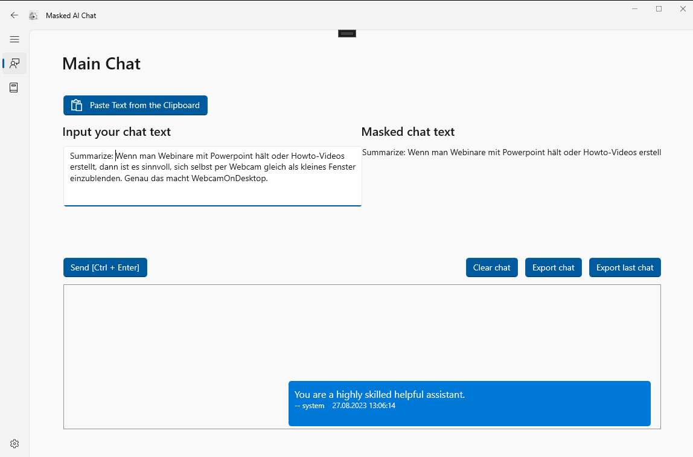
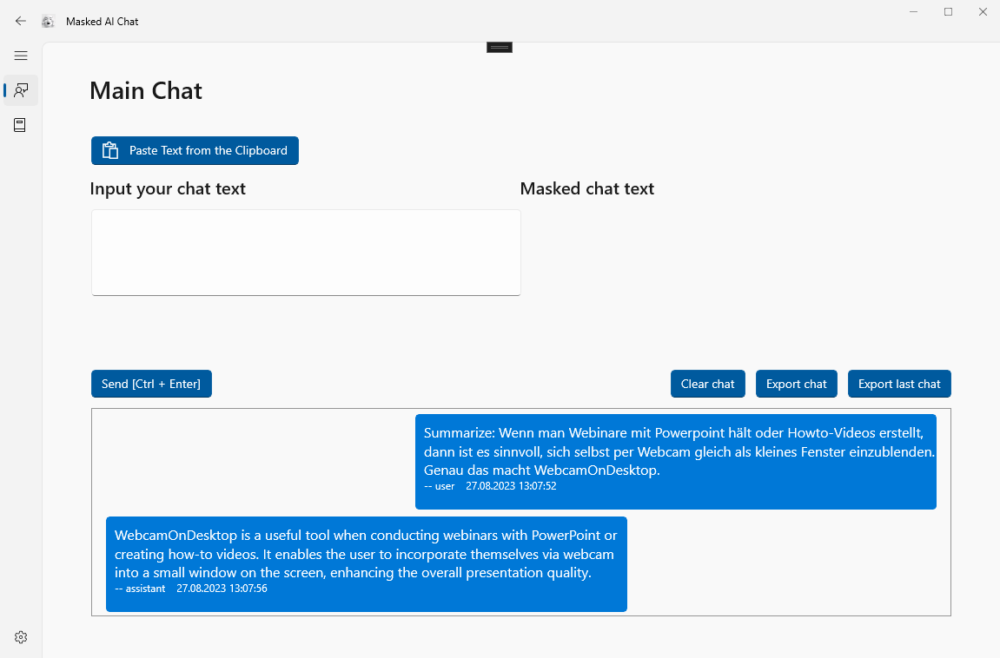
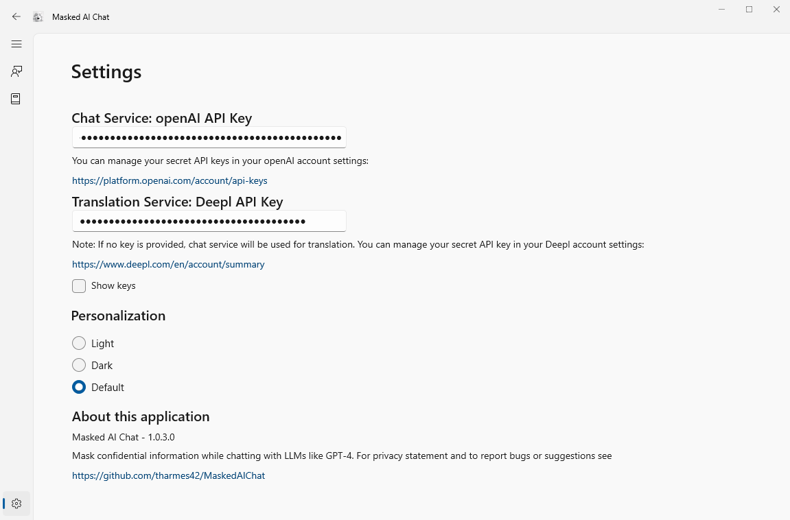
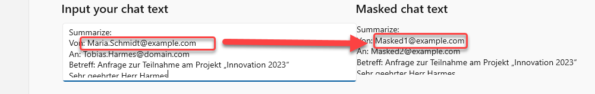
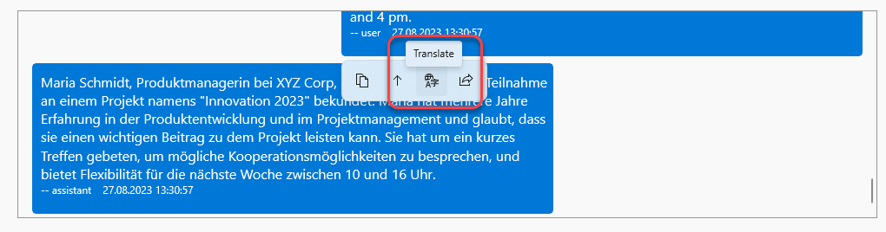

# MaskedAIChat - WinUI 3 Windows App

## Overview

MaskedAIChat is a Windows application crafted using WinUI 3. It offers users the ability to have text-based conversations with advanced language models like GPT (Generative Pre-trained Transformer) in real-time.





## Features

- Real-time interaction with GPT-based language models
- E-Mail addresses are automatically masked to protect your privacy and the privacy of others

- Automatic translation of messages to System Language (English by default)

- Theme and settings customization options

## Prerequisites
- __(Required)__ API Key for GPT-4 (OpenAI), you can manage your API key [here](https://platform.openai.com/account/api-keys)
- (Optional) for better Translations: DeepL Translator, you can manage your API key [here](https://www.deepl.com/en/account/summary)
- Windows 10 or later

## Prerequisites for building

- Visual Studio 2022 or later

## Building

1. **Clone the Repository**

   ```
   git clone https://github.com/tharmes42/MaskedAIChat.git
   ```

2. **Open the Solution in Visual Studio**

   Navigate to the directory where you cloned the repository and open the `.sln` file.

3. **Build and Run**

   Press `F5` to build and run the project.

## Usage

1. **Launch the App**

   Open the application either directly from Visual Studio or via the built executable.

2. **Configure API Key**

   Navigate to the settings panel and input your GPT API key.

3. **Start Conversing**

   Start your conversation by entering your message in the chatbox and clicking `Send`.

## License

MaskedAIChat is licensed under the MIT License. For more details, see the [LICENSE.txt](./LICENSE.txt) file.
